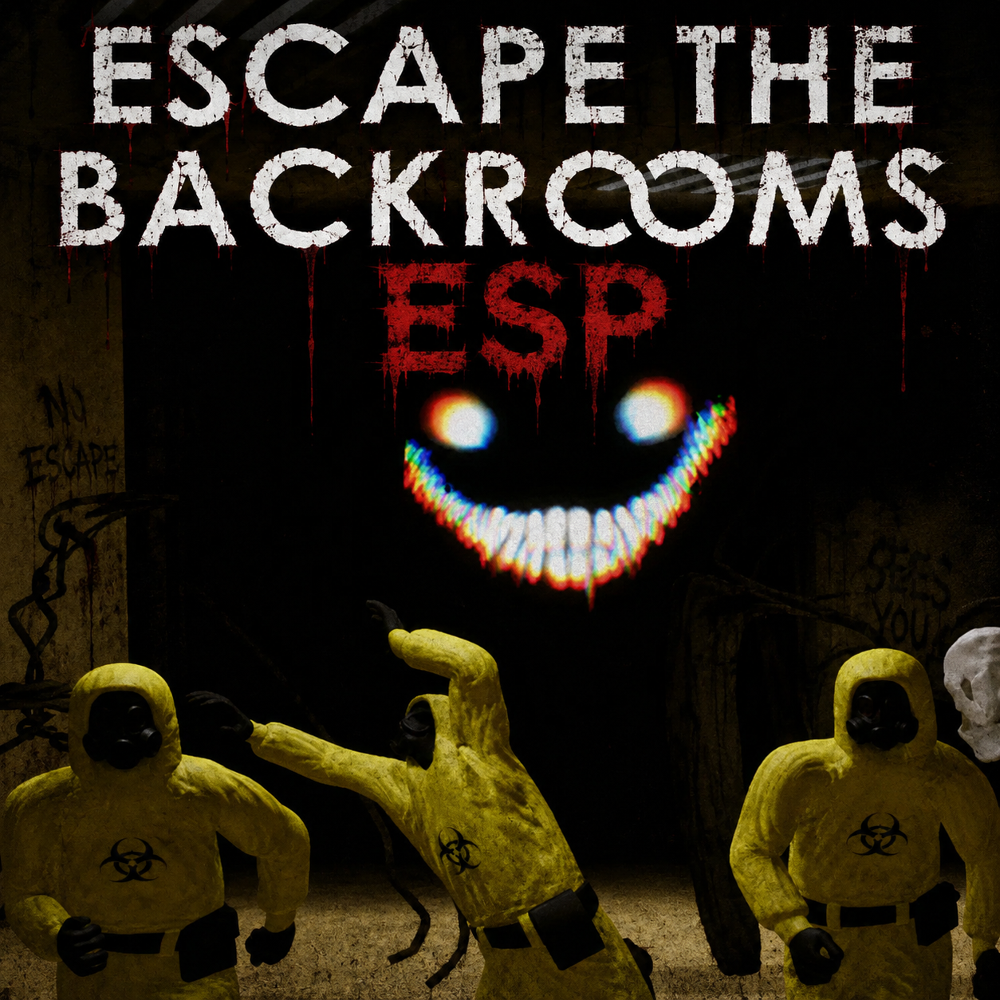
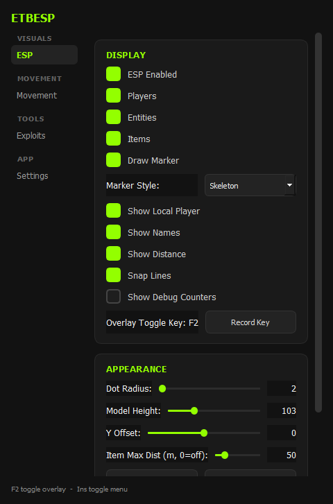
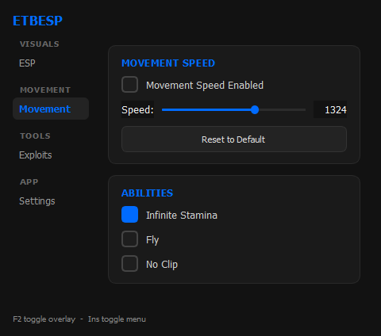
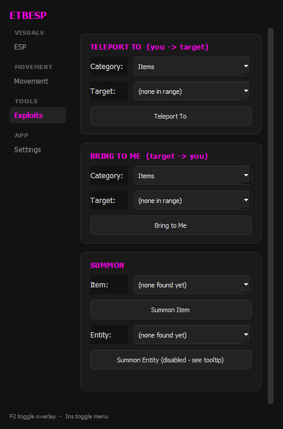
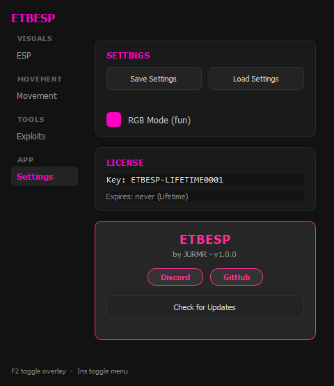

# MCESP
### Escape the Backrooms External ESP + Aimbot

A fully external ESP and aimbot for **Escape the Backrooms**.

---

## Visuals

<table>
<tr>
<td align="center" width="25%"> <b>ESP</b></td>
</tr>
</table>

---

## Movement

<table>
<tr>
<td align="center" width="25%"> <b>Movement</b></td>
</tr>
</table>

---

## Tools

<table>
<tr>
<td align="center" width="25%"> <b>Teleport</b></td>
</table>

---

## Settings

<table>
<tr>
<td align="center" width="25%"> <b>Teleport</b></td>
</tr>
</table>

---
